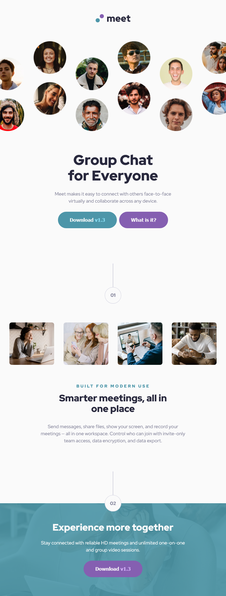

# Frontend Mentor - Meet landing page solution

This is a solution to the [Meet landing page challenge on Frontend Mentor](https://www.frontendmentor.io/challenges/meet-landing-page-rbTDS6OUR). Frontend Mentor challenges help you improve your coding skills by building realistic projects. 

## Table of contents

- [Overview](#overview)
  - [The challenge](#the-challenge)
  - [Screenshot](#screenshot)
  - [Links](#links)
- [My process](#my-process)
  - [Built with](#built-with)
  - [What I learned](#what-i-learned)
- [Author](#author)
- [Acknowledgments](#acknowledgments)

## Overview

### The challenge

Users should be able to:

- View the optimal layout depending on their device's screen size
- See hover states for interactive elements

### Screenshot

#### Mobile

#### Tablet

#### Desktop


### Links

- Solution URL: [github.com/ashkir004/meet-landing-page](https://github.com/ashkir004/meet-landing-page)
- Live Site URL: [meet-landing-page-ashkir004.netlify.app/](https://meet-landing-page-ashkir004.netlify.app/)

## My process

### Built with

- Semantic HTML5 markup
- CSS custom properties
- Flexbox
- CSS Grid
- Mobile-first workflow


### What I learned

#### Use of Pseudo-elements

```css
.hero {
    display: grid;
    grid-template-columns: 1fr 1fr 1fr;
    grid-template-rows: 1fr;
    gap: var(--space-400);
    margin: 0 auto;
    padding: var(--space-800) 0 var(--space-800);
    overflow-x: hidden;
}

.hero::before {
    content: '';
    display: block;
    background: url(/assets/desktop/image-hero-left.png) top right/contain no-repeat;
    width: calc(394 / 16 * 1rem);
    height: calc(303 / 16 * 1rem); 
    margin-right: auto;
    margin-left: -1.5rem;
}

.hero__cta {
    grid-column: 2;
    grid-row: 1;
    gap: var(--space-400);
    margin-top: 1.5rem;
    margin-bottom: 1.5rem;
}

.hero::after {
    content: '';
    display: block;
    background: url(/assets/desktop/image-hero-right.png) bottom right/contain no-repeat;
    width: calc(394 / 16 * 1rem);
    height: calc(303 / 16 * 1rem);
    margin-left: auto;
    align-self: flex-end;
    margin-right: -1.8rem;
}

```

## Author

- Frontend Mentor - [@ashkir004](https://www.frontendmentor.io/profile/ashkir004)


## Acknowledgments

- Frontend Mentor - [Frontendmentor.io](https://www.frontendmentor.io/)

- Netlify - [Netlify.com](https://www.netlify.com/)

